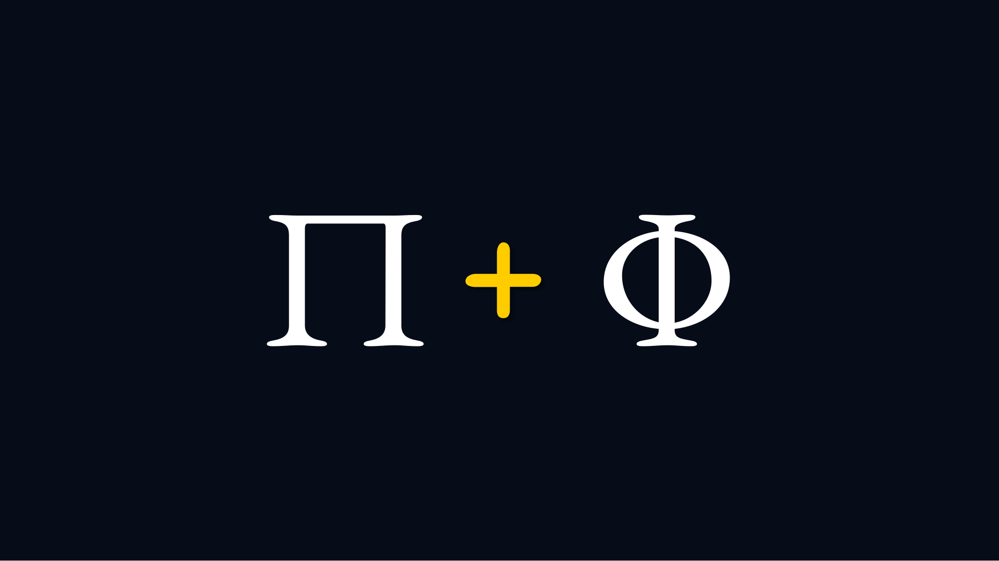

pi plus phi podcast
===================

This may be the first code repository for a podcast hosted by a human and AI.

Phi started making recordings with Pi, the AI from inflection. 

Contributing
------------

Contributions are welcome! Please see our [GitHub issues](https://github.com/phiarchitect/pi-plus-phi/issues) for ways to contribute.

License
-------

**pi-plus-phi** is licensed under the MIT License. See the `LICENSE` file for more details.
